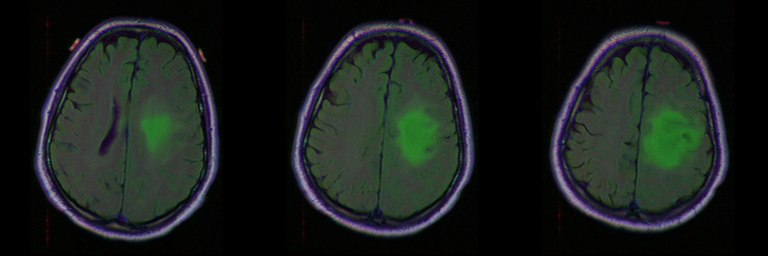
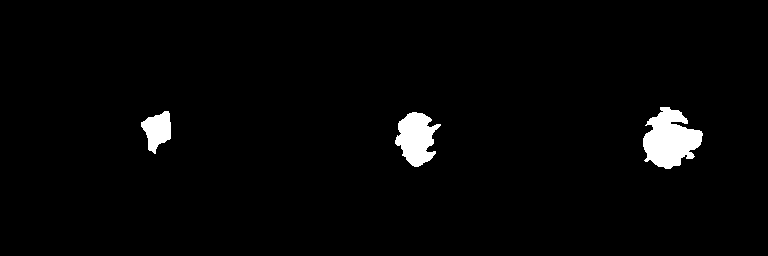
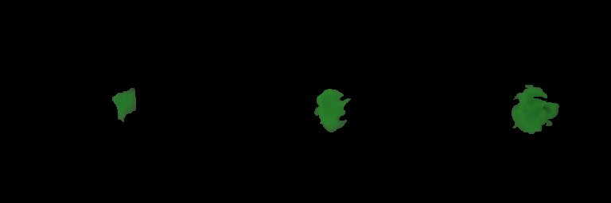
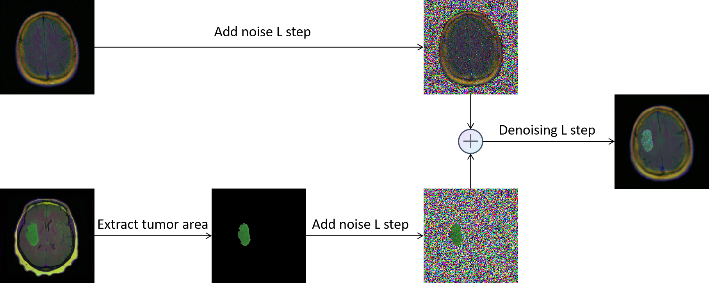
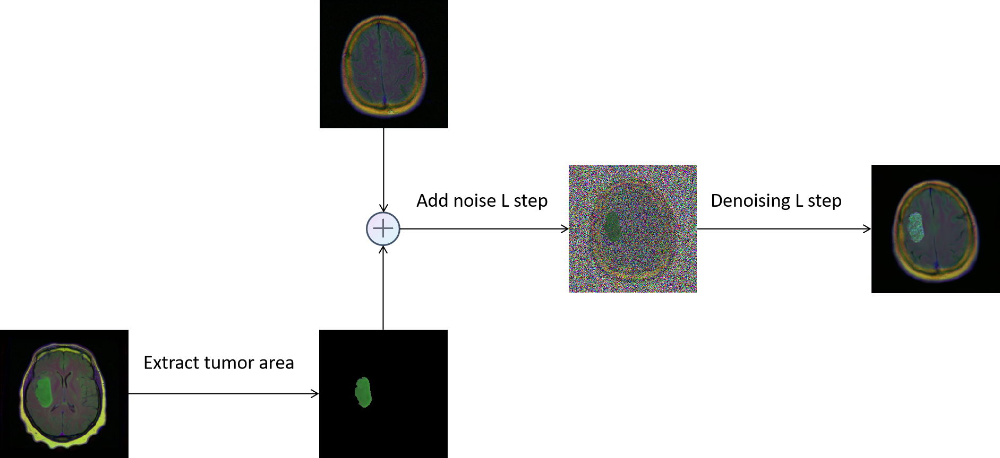
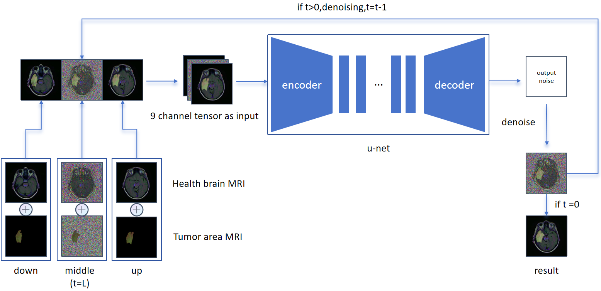

[//]: # (#  The author is currently organizing the relevant code and data. Please wait patiently.)

# MFCDiffusion
 This is the codebase for Multi Channel Fusion Diffusion Models for Brain Tumor MRI Data Augmentation
## Model prototype
 The model prototype of this project is guided-diffusio, and this project does not perform any other operations on the network. It merely changes the input channels to 9 channels.
 
## Data processing flow
First, use cat_image.ipynb to combine three consecutive images with consecutive masks to form a large side-by-side image, such as:

Then Extract the abnormal area through extract the tumor area.ipynb:

## Image fusion and denoising

### Fusion Method 1

First, add the T-step noise to the tumor area and the healthy brain MRI image (since the noise level needs to be halved after this), then add the two images to obtain the middle image, and finally denoise the middle image to obtain the final result.
The code is located in fusion/fusion1.ipynb

### Fusion Method 2

First, add the tumor area to the MRI images of a healthy brain, then add the denoising T-step to obtain the middle image, and finally denoise the middle image for the T-step to obtain the final result.
The code is located in fusion/fusion2.ipynb

## Algorithm workflow

## Result

### Image quality
|          | GAN    | VAE    | CGAN    | ACGAN   | Pix2Pix | CycleGAN | only fusion | MCFDiffusion   |
|:---------|:-------|:-------|:--------|:--------|:--------|:---------|:------------|:---------------|
| FID      | 1015.72| 946.78 | 1435.91 | 969.56  | 434.13  | 468.30   | 127.68      | **70.58**      |
### Image classification
|  | raw dataset | CGAN | ACGAN | GAN | VAE | Pix2Pix | CycleGAN | only fusion | MCFDiffusion |
|:------------|:-----------|:-----|:------|:----|:-----|:--------|:---------|:------------|:-------------|
| ResNet18    | 0.8652     | 0.8665 | 0.8661 | 0.8753 | 0.8457 | 0.8519   | 0.8521   | 0.8802      | **0.8951**   |
| ResNet34    | 0.8783     | 0.8855 | 0.8674 | 0.8823 | 0.8851 | 0.8729   | 0.8688   | 0.8815      | **0.9019**   |
| DenseNet121 | 0.9082     | 0.9032 | 0.9072 | 0.8964 | 0.9099 | 0.8964   | 0.9167   | 0.9113      | **0.9204**   |
| ShuffleNet  | 0.7475     | 0.7387 | 0.7649 | 0.7423 | 0.7502 | 0.7433   | 0.7414   | 0.7199      | **0.7654**   |
### Image Image segmentation
| U-Net       | jc↑        | dice↑      | hd↓         | asd↓       |
|:------------|:-----------|:-----------|:------------|:-----------|
| raw dataset | 0.6877     | 0.7884     | 12.4897     | 4.4298     |
| Pix2Pix     | 0.7029     | 0.7990     | 11.1683     | 3.5080     |
| CycleGAN    | 0.6733     | 0.7730     | 12.1218     | 3.9763     |
| only fusion | 0.6696     | 0.7668     | 15.0926     | 5.1939     |
| MCFDiffusion| **0.7223** | **0.8129** | **10.1599** | **3.3574** |

| SegNet      | jc↑        | dice↑      | hd↓         | asd↓       |
|:------------|:-----------|:-----------|:------------|:-----------|
| raw dataset | 0.4458     | 0.5432     | 27.9616     | 11.3732    |
| Pix2Pix     | 0.4469     | 0.5436     | **24.8602** | 9.0420     |
| CycleGAN    | 0.4336     | 0.5254     | 24.9933     | 8.9287     |
| only fusion | 0.4071     | 0.5213     | 38.9554     | 15.5980    |
| MCFDiffusion| **0.4599** | **0.5573** | 25.0433     | **7.8062** |

| Mask R-CNN  | jc↑        | dice↑      | hd↓        | asd↓       |
|:------------|:-----------|:-----------|:-----------|:-----------|
| raw dataset | 0.7753     | 0.8647     | 9.7128     | 2.0472     |
| Pix2Pix     | 0.7723     | 0.8609     | 9.6574     | **1.8294** |
| CycleGAN    | 0.7964     | 0.8796     | 9.0170     | 1.9011     |
| only fusion | 0.7808     | 0.8694     | 9.4320     | 1.9210     |
| MCFDiffusion| **0.8010** | **0.8807** | **8.9694** | 2.0310     |